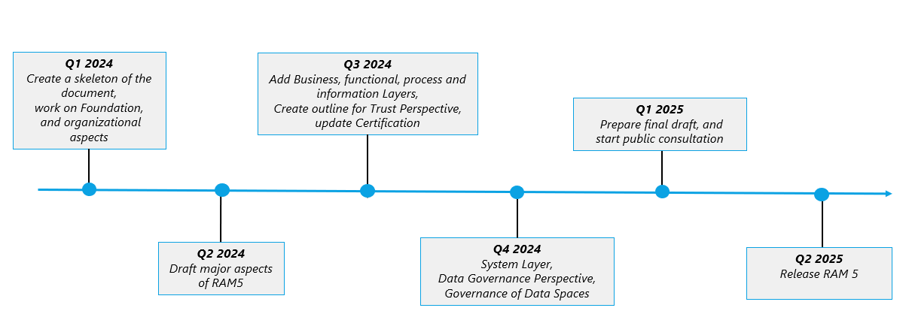

# IDS RAM5 #

Welcome to the IDS RAM 5 repository of the [IDSA](../../../idsa), the working repository to create a new version of IDS-RAM with a new and modular approach.

## Overview ##

The IDS-RAM provides a conceptual framework for designing and implementing IDS-compliant data spaces. It defines the key roles, their interactions, the components, and the principles that govern the architecture of an IDS data space. 

An IDSA Techtalk webinar provides an overview of the current release version IDS RAM 4.0: [Recording](https://youtu.be/vyhGrT2pEOg) & [Slides](https://internationaldataspaces.org/wp-content/uploads/dlm_uploads/IDSA-Tech-Talk-IDS-RAM.pdf)

This repository will be used to create the new version of IDS RAM. 

## Vision for RAM 5 ##

 
#### _Figure 1.1: Improvements envisioned for IDS RAM 5 at a high-level_

RAM 5 will be aligned with the latest developments in IDSA and Data Spaces. It will provide an overview for technical readers on how to create an architecture for a data space, to participate in a data space, and to provide value added services for data spaces. To do so, RAM5 will sketch architectural decision areas for different roles in data spaces. 

The RAM 5 document will not be a linear document like RAM 4 but will contain links between parts of the layers and perspectives. Other improvements in RAM 5 will include description of decentralized approaches and updates to the information model, among other things.

## Timeline ##

The expected timeline is to provide a first draft of RAM 5 until the end of quarter 2 2024 and a final document until the end of quarter 2 2025. 

#### _Figure 1.1: Expected timeline for the IDS RAM 5_

Please see the [Project outline document](./resources/RAM5projectoutline.docx) for more details on the activities planned for each quarterly milestone.

## Structure ##

RAM 5 will follow the same five-layer structure used by RAM 4.0 to express various stakeholders’ concerns and viewpoints at different levels of granularity: business, functional, process, information, and system.

This is complemented with three perspectives that need to be implemented across all these layers: Trust (previously named Security in RAM 4.0), Certification and Governance.

 
#### _Figure 1.1: Layers and Perspectives of IDS RAM_

Each of these layers and perspectives will be described in a different section of this document. Two additional sections will be added to provide additional context for the readers:
- Foundation section, which will present all the concepts that one should be familiar with before delving into the details of the RAM layers and perspectives. 
- Context of IDS section, to provide overall info on IDS, and how it relates to other initiatives and concepts.

This results in the following structure for this repository: 
<!-- to be added in when we have this // - [Front Matter](./documentation/FrontMatter.md) -->
- [Section 1: Introduction](./documentation/1_introduction/README.md)
- [Section 2: Context of IDS](./documentation/2_context/README.md)
- [Section 3: Layers of the RAM](./documentation/3_layers/README.md)
  - [Section 3.1: Foundation](./documentation/3_layers/3_1_foundation/README.md)
  - [Section 3.2: Business Layer](./documentation/3_layers/3_2_business/README.md)
  - [Section 3.3: Functional Layer](./documentation/3_layers/3_3_functional/README.md)
  - [Section 3.4: Information Layer](./documentation/3_layers/3_4_information/README.md)
  - [Section 3.5: Process Layer](./documentation/3_layers/3_5_process/README.md)
  - [Section 3.6: System Layer](./documentation/3_layers/3_6_system/README.md)
- [Section 4: Perspectives of the RAM](./documentation/4_perspectives/README.md)
  - [Section 4.1: Security Perspective](./documentation/4_perspectives/4_1_trust/README.md)
  - [Section 4.2: Certification Perspective](./documentation/4_perspectives/4_2_certification/README.md)
  - [Section 4.3: Governance Perspective](./documentation/4_perspectives/4_3_data_governance/README.md)

## How to contribute ##

Check the open [issues](https://github.com/International-Data-Spaces-Association/RAM5/issues)
and [pull requests](https://github.com/International-Data-Spaces-Association/RAM5/pulls).

Please also consider the following:

- [Project board](https://github.com/orgs/International-Data-Spaces-Association/projects/11/views/5) for an overall view of the RAM 5 activities, 
- [Code of Conduct](./CODE_OF_CONDUCT.md),
- [Contributing Guidelines](./CONTRIBUTING.md),
- [License](./LICENSE.md),
- [Changelog](./CHANGELOG.md)

## How to connect with others working on RAM 5 ##

- Join the **RAM 5 bi-weekly Touch-point calls** on **Mondays** at **10 CEST**: This is the sync point for contributors and maintainers. 

- Attend the **[Working Group Architecture](https://github.com/International-Data-Spaces-Association/members-area/tree/main/WorkingGroups/Architecture) quarterly meetings**: These are usually on-site events where the vision and next steps for RAM 5 is discussed and the work completed in each quarter gets reviewed/approved by the WG members

**Upcoming meetings:**
- April 15, 9:00 - 10:30 CEST, [Teams link](https://teams.microsoft.com/l/meetup-join/19%3ameeting_Y2RiMzIyMjAtMjExNC00MTA3LTk4YzQtYTMwOGZkM2EyYTYy%40thread.v2/0?context=%7b%22Tid%22%3a%22b346d634-acfb-42c7-bd44-f1557ee89b1b%22%2c%22Oid%22%3a%22c9086e3b-6b48-4bef-817c-7f843ae73578%22%7d): **RAM 5 Q2 Planning meeting**, in which we will onboard new contributors, review Q1 items, and plan Q2 activities 
- April 22 & May 6, 10:00 - 11:00 CEST, [Teams link](https://teams.microsoft.com/l/meetup-join/19%3ameeting_Y2RiMzIyMjAtMjExNC00MTA3LTk4YzQtYTMwOGZkM2EyYTYy%40thread.v2/0?context=%7b%22Tid%22%3a%22b346d634-acfb-42c7-bd44-f1557ee89b1b%22%2c%22Oid%22%3a%22c9086e3b-6b48-4bef-817c-7f843ae73578%22%7d): **Regular RAM 5 Touch-point calls**

- April 3rd week: Online **Workshops on Trust and Observability** topics, Date/time TBD
- June 18, location TBD, **Q2 Working group Architecture meeting**

## Further resources ##

The IDS RAM contains the conceptual level framework for dataspaces including technology-agnostic specifications. It is complemented with additional documents and repositories:
 - [IDSA Rulebook](https://docs.internationaldataspaces.org/idsa-rulebook-v2/) describes how to operate a dataspace based on the BLOFT (Business, Legal, Operational, Functional, Technical) aspects.
 - [Dataspace Protocol](https://docs.internationaldataspaces.org/dataspace-protocol/overview/readme) is a set of specifications designed to facilitate interoperable data sharing between entities governed by usage control and based on Web technologies. 
 - [DSSC Blueprint](https://dssc.eu/space/BVE/357073006/Data+Spaces+Blueprint+v1.0) is a set of guidelines by the [Dataspaces support Centre](https://dssc.eu/) to support the development cycle of data spaces. It includes the conceptual model of a data space, data space building blocks, and recommended standards and specifications.
 <!-- - [IDS-G](https://github.com/International-Data-Spaces-Association/IDS-G) contains specific details on specifications, e.g. APIs and their descriptions. -->

## Previous Versions ##

IDS RAM 4
- [IDS-RAM 4.2 current in Docs](https://docs.internationaldataspaces.org/ids-knowledgebase/v/ids-ram-4) and on [Github](https://github.com/International-Data-Spaces-Association/IDS-RAM_4_0/)
- [IDS-RAM 4.1](https://github.com/International-Data-Spaces-Association/IDS-RAM_4_0/releases/tag/v.4.1.2)
- [IDS-RAM 4.0](https://github.com/International-Data-Spaces-Association/IDS-RAM_4_0/releases/tag/v.4.0.0)

Earlier versions
- [IDS RAM 3.0](https://internationaldataspaces.org/download/16630/)
- [IDS RAM 2.0](https://internationaldataspaces.org/download/16641/)
- [IDS RAM 1.0](https://internationaldataspaces.org/download/16652/)