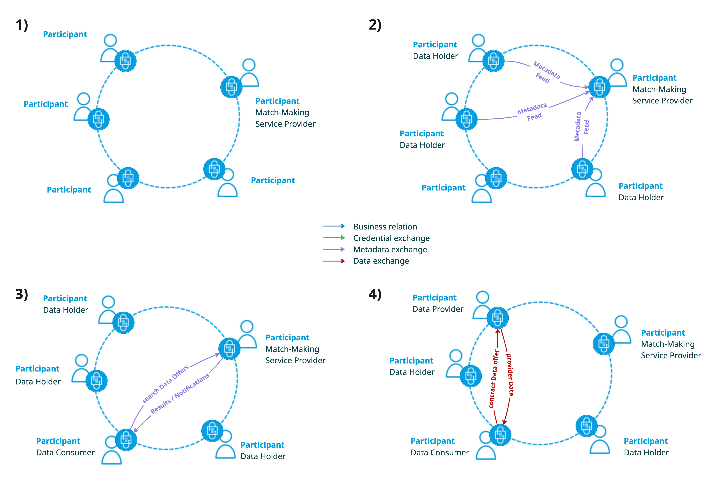
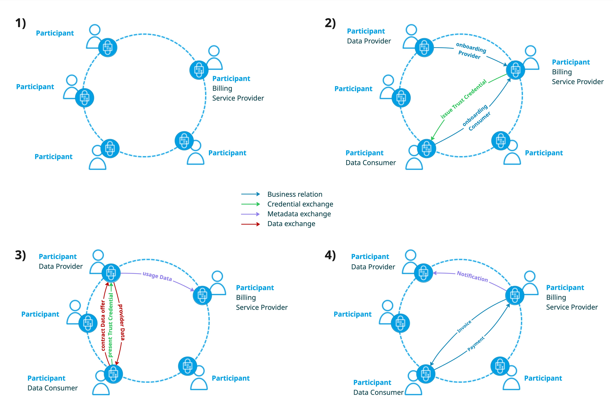

# Value-Adding Services in Decentralized Data Spaces

While decentralized data spaces fundamentally rely on autonomous participants interacting through standardized protocols such as the Dataspace Protocol (DSP) and the Decentralized Claims Protocol (DCP), many real-world ecosystems require additional value-adding services to support discovery, coordination, trust and economic processes. Rather than introducing centralized platform components, these services must be implemented in a way that preserves the core principles of decentralization, sovereignty and participant autonomy, as set out in the Rulebook's chapter on [Decentralization](https://kb.internationaldataspaces.org/external/rulebook/007_Decentralization). In this section, we describe an architectural pattern for integrating value-adding services as specialized participants within the data space itself. We use a matchmaking service and a billing service as concrete examples and show how they can be realized using standard data space interactions.

Each service operates under the governance rules of the [Data Space Governance Authority (DSGA)](https://kb.internationaldataspaces.org/external/rulebook/006_DSGA) and the accepted [Dataspace Trust Framework(s) (DTFs)](https://kb.internationaldataspaces.org/external/rulebook/009_Dataspace_Trust_Frameworks). Credential issuance and verification follow those DTFs and are exchanged using DCP, while contract negotiation and data exchange are governed by DSP. This keeps the services interoperable and avoids creating privileged, centralized control points.

## Matchmaking Service

A matchmaking service can be offered by one or more independent service provider organizations; a data space may have several competing matchmaking providers, and each participant individually decides which of them, if any, to use for a given negotiation. Such a service typically runs as part of the provider's own backend rather than as a mandatory, central component of the data space, consistent with the Rulebook's [Marketplaces](https://kb.internationaldataspaces.org/external/rulebook/123_Marketplaces) guidance. Data-holding participants that wish to make their assets discoverable provide structured metadata about their data offerings to a matchmaking participant of their choice, for example via event-based metadata feeds or other mechanisms such as pull-based retrieval. This metadata includes references to the corresponding DSP contract offers through which consumers can later negotiate access to the actual data. An event-driven approach allows a matchmaking service to efficiently integrate updates, additions and removals into its continuously maintained search index.

Based on the aggregated metadata, a matchmaking service builds and operates a searchable index and exposes a contract-governed search API within the data space. Any participant seeking data can establish a DSP contract with a matchmaking service of its choice to use this search interface. In addition to synchronous search, asynchronous interaction patterns can be supported: consumer participants may register data needs at a matchmaking service and are notified when matching metadata becomes available.

Search results returned to consumers contain metadata and references to the actual DSP offers of the respective data providers. As with any data space interaction, the subsequent negotiation, contracting and exchange of the actual data remain peer-to-peer between the consumer and the data-providing participants and are fully governed by DSP; the matchmaking service is not a party to that negotiation. The provision of metadata to the matchmaking service and the use of the search API are likewise governed by DSP contracts for interoperable, standardized integration.

Metadata visibility can be scoped by policy. Providers may publish public metadata, or restrict metadata feeds and search access using DSP contracts and DCP claims (e.g., membership or role-based credentials). Update and removal events are authorized by the original publisher, preserving data sovereignty while still enabling efficient discovery.

## Billing Service

A billing service can likewise be offered by one or more independent billing service provider organizations, and each participant individually decides which billing provider, if any, to use for a given exchange. Such a service typically runs as part of the provider's own backend rather than as a mandatory, central component of the data space. Both data providers and data consumers that wish to use a billing provider's infrastructure are onboarded as its customers. Onboarding establishes the roles and credentials: providers are registered and authorized to report usage for billable exchanges, while consumers receive a trust credential that verifies their eligibility to be billed through that specific billing provider.

After onboarding, a data provider may offer data under the explicit condition that consumption of the corresponding DSP contract offer is billed via a billing provider it accepts. To enforce this, the provider requires that only consumers presenting a valid billing trust credential issued by that billing provider are allowed to contract the offer. These trust credentials are issued and presented using DCP.

As with any data space interaction, the contract negotiation and the data exchange itself remain peer-to-peer between provider and consumer and are governed by DSP; presenting the billing trust credential is simply an additional proof required within that one negotiation, not a delegation of the negotiation to the billing provider. In parallel, the provider transmits usage data for all transfers to the billing service provider. The billing provider performs invoicing and payment processing directly with the consumer organization and sends operational notifications, such as payment and settlement status, back to the data provider. Trust credential exchange is governed by DCP, while usage data, notifications and contractual data exchange are consistently governed by DSP, preserving the decentralized control model.
