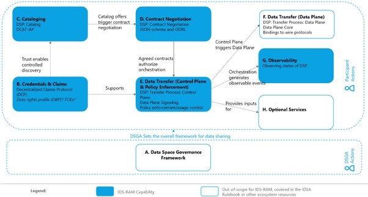

# Mapping IDS-RAM Capabilities to Specifications

## Technical specifications currently available for each RAM capability

<!-- Figure 4 -->
  
  
## Index of RAM architectural capabilities and relevant technical specifications  

  
| Architectural Capability | Technical Specifications |
| ------------------------- | -------------------------- |
| [Credentials & Claims](Credentials_and_Claims.md) | [Decentralized Claims Protocol (DCP)](https://eclipse-dataspace-dcp.github.io/decentralized-claims-protocol/) |
|    | [W3C Verified Credentials Data Model](https://www.w3.org/TR/vc-data-model-2.1/)  |
|    |[Decentralized Identifiers (DIDs)](https://www.w3.org/TR/did-1.1/) |
|      |     |
| [Cataloging](Cataloging.md) | [Dataspace Protocol: Catalog](https://eclipse-dataspace-protocol-base.github.io/DataspaceProtocol/2025-1-err2/#catalog-protocol) |
|    | [Data Catalog Vocabulary (DCAT)](https://www.w3.org/TR/vocab-dcat-3/) |
|      |     |
| [Contract Negotiation](Contract_Negotiation.md) | [Dataspace Protocol: Contract Negotiation](https://eclipse-dataspace-protocol-base.github.io/DataspaceProtocol/2025-1-err2/#negotiation-protocol) |
|    | [ODRL Information Model](https://www.w3.org/TR/odrl-model/)  |
|    | [ODRL Vocabulary & Expression](http://www.w3.org/TR/vocab-odrl/) |
|      |     |
| [Data Transfer](Data_Transfer.md) | [Dataspace Protocol: Transfer Process](https://eclipse-dataspace-protocol-base.github.io/DataspaceProtocol/2025-1-err2/#transfer-protocol) |
|  | [Dataplane Signaling](https://eclipse-dataplane-signaling.github.io/dataplane-signaling) |
|      |     |
| [Observability](Observability.md) | Observing [Dataspace Protocol](https://eclipse-dataspace-protocol-base.github.io/DataspaceProtocol/) State Machines |
