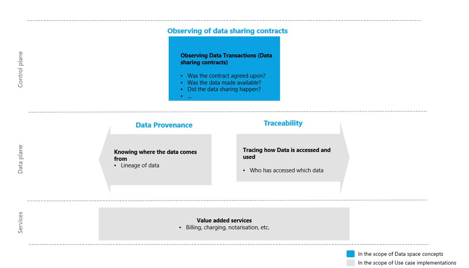
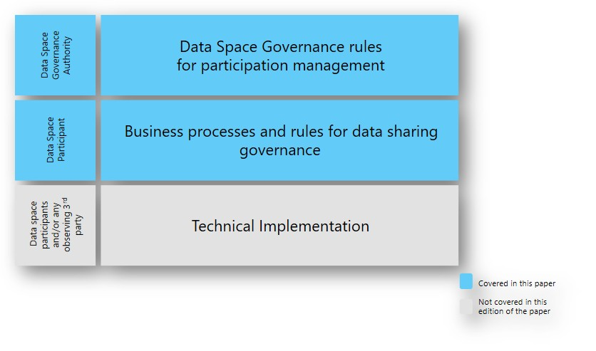

# Observability

This is the capability for **observing data sharing transactions** to ensure transparency, accountability and trust.  

Observability:  

- Is **policy-driven and role-based**
- Can be centralized, federated, or decentralized
- Relies on protocol-level events rather than raw data inspection

Observability strengthens trust by enabling verification of expected behavior without violating data sovereignty.

A major architectural shift in this version of IDS-RAM is the deprecation of the centralized **Clearing House** component and the move towards a more focused approach for the observability concept with the introduction of more flexible and decentralized **Observer** role.

## Key architectural concepts

- **The Observer Role:** Observability is no longer tied to a single central component. Instead, it is a role that can be fulfilled by one or multiple parties, i.e. the data sharing transaction participants (Provider or Consumer) and/or an authorized third party.
- **Purpose-Driven Monitoring:** Unlike general system monitoring, IDS Observability is "targeted and purposeful." It specifically monitors the **Dataspace protocol activities and states** to verify:
  - Was the contract successfully concluded?
  - Was the data actually transferred?
  - Was the transaction executed according to the negotiated policies?

Observability is closely linked to other concepts such as Provenance and Traceability. However, the scope of this capability is not solving end-to-end observability challenges in data space ecosystems. These would imply very diverse requirements and therefore would be best left to use-case implementations to leave room for the flexibility they would need.  

<!-- Figure 1 -->
  

It is important to note that at the technical layer, this capability may be implemented by approaching the sharing of observability data just like another data sharing contract, however, setting up the necessary business processes and governance rules are the really necessary steps to truly achieve observability.
 <!-- Figure 2 -->
  

## Further Resources

- **IDSA Rulebook Guidance**
  - [Observability](https://kb.internationaldataspaces.org/external/rulebook/121_Observability)

- **Focus Papers**
  - [IDSA Position Paper: Observability in Data Spaces](https://internationaldataspaces.org/download/51606/?tmstv=1772198923)

- **Specifications**
  - [Dataspace Protocol](https://eclipse-dataspace-protocol-base.github.io/DataspaceProtocol/) - See State Machines for what can be observed for each sub-protocol 
