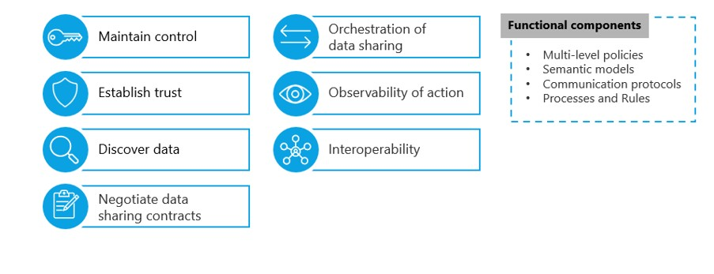
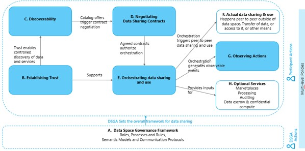
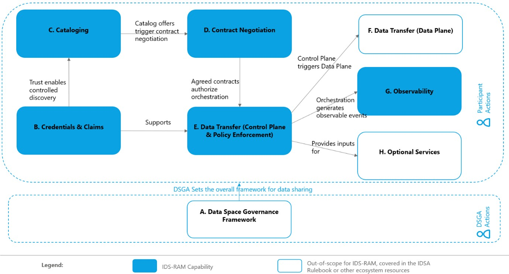

# Architecture Principles

This chapter provides architectural insights on the main technical concepts of dataspaces described in the [IDSA Knowledgebase](https://kb.internationaldataspaces.org/dataspace) and in the [IDSA Rulebook](https://kb.internationaldataspaces.org/external/rulebook/102_Foundational_concepts_of_a_data_space) and explains how to realize them using technical specifications such as the Dataspace Protocol (DSP) and the Decentralized Claims Protocol (DCP).

## Introduction - *Starting with the main concepts*

The [IDSA Rulebook](https://kb.internationaldataspaces.org/external/rulebook/003_WhatIsADataspace/) and the [ISO/IEC 20151-1 Standard "Information technology — Cloud computing and distributed platforms — Dataspace concepts and characteristics"](https://www.iso.org/standard/86589.html) define Data Spaces as:

> Environment enabling trusted data sharing between participating parties, based on an agreed governance framework, along with an agreed set of policies, semantic models, standardized protocols, processes, and facilitating services.

Based on this, data spaces have the following main concepts and characteristics, as explained in further detail in the [IDSA Rulebook](https://kb.internationaldataspaces.org/external/rulebook/102_Foundational_concepts_of_a_data_space/) and [ISO/IEC 20151-1](https://www.iso.org/standard/86589.html):

<!-- Figure 1 -->
  

The following diagram maps the relationships between these concepts, not intending to follow a process/runtime flow order, but focusing on highlighting relationships and dependencies between them.  

<!-- Figure 2 -->
  

Please note that some essential characteristics such as **maintaining control** and **interoperability** are not depicted in this picture, as these are cross-cutting concepts which require actions in almost each block. They have been omitted from the diagram for the sake of readability.

**Multi-level policies** (i.e. membership policies at data space level, access policies for controlled discovery of metadata, data sharing contract policies, data use policies) needed in a data space are depicted vertically in this picture to express how they are applied in an overarching way across different levels.

## IDS-RAM Architectural Capabilities - *Turning data space concepts into technical guidance*

While the IDSA Rulebook defines the essential data space concepts, the IDS-RAM operationalizes these high-level principles into technical guidance in the form of logical components and behavioural patterns.  

The architectural capabilities defined in IDS-RAM represent the functional building blocks necessary for interoperable and trusted data sharing. These are based on the current technical approaches at hand and are centered around the following key technical specifications and standardization work items to ensure interoperability:

- **[Dataspace Protocol (DSP, ISO/IEC DIS 26450)](https://eclipse-dataspace-protocol-base.github.io/DataspaceProtocol/)** which defines publication/discovery, agreement negotiation, and data access interactions for interoperable data sharing.

- **[Decentralized Claims Protocol (DCP, ISO/IEC DIS 26451)](https://eclipse-dataspace-dcp.github.io/decentralized-claims-protocol/)** which provides an overlay for organizational identity and trust/credential verification while preserving privacy.

- **[Data Plane Signaling](https://github.com/eclipse-dataplane-signaling/dataplane-signaling)** which specifies interoperable control plane/data plane communication.

The visual map of data space concepts provided earlier then evolves into the following view of architectural capabilities:  

<!-- Figure 3 -->
  

### A. Data Space Governance Authority

Sets the overall framework for data sharing between participants by establishing a trust framework, roles, processes, and rules.

!!! note
    The DSGA is not a technical artefact for the IDS-RAM, but a functional role described in the IDSA Rulebook. IDS-RAM focuses mostly on the participant side; however, the governance framework is included for the sake of completeness.

!!! tip "See also"
    IDSA Rulebook pages on [DSGA](https://kb.internationaldataspaces.org/external/rulebook/006_DSGA) and IDS-RAM [Architectural patterns for DSGA](https://github.com/International-Data-Spaces-Association/IDS-RAM/tree/20260713-update-dsga-architecture-pattern/docs/Pattern).

### B. [Credentials & Claims](Credentials_and_Claims.md)

Establish trust-relevant identity and attributes used throughout subsequent capabilities on the participant side. This capability is closely linked with the DCP specification.  

!!! tip "See also"
    IDSA Rulebook pages on [Trust](https://kb.internationaldataspaces.org/external/rulebook/008_Trust), [Dataspace Trust Frameworks](https://kb.internationaldataspaces.org/external/rulebook/009_Dataspace_Trust_Frameworks), [Attributes and claims](https://kb.internationaldataspaces.org/external/rulebook/104_Attributes_and_claims), [Identity](https://kb.internationaldataspaces.org/external/rulebook/107_Identity), [Decentralized onboarding](https://kb.internationaldataspaces.org/external/rulebook/140_Decentralized_Patterns_Onboarding) and working draft paper on [Identifiers in Data Spaces](https://github.com/International-Data-Spaces-Association/identity-in-data-spaces).

### C. [Cataloging](Cataloging.md)

Supports the discovery of data and services through metadata publication and controlled visibility.

Cataloging capability is based on the DSP Catalog Protocol specification, which makes use of DCAT and application profiles.

!!! tip "See also"
    IDSA Rulebook page [Data Discovery Services](https://kb.internationaldataspaces.org/external/rulebook/120_DataDiscoveryServices) and and IDS-RAM [Architectural patterns for Catalogs](https://github.com/International-Data-Spaces-Association/IDS-RAM/tree/20260713-update-catalogs-architecture-pattern/docs/Pattern#catalogs).

### D. [Contract Negotiation](Contract_Negotiation.md)

Formalizes rights and obligations into enforceable data sharing agreements.

This capability is realized by the DSP Contract Negotiation Protocol.

!!! tip "See also"
    IDSA Rulebook page [Data Sharing](https://kb.internationaldataspaces.org/external/rulebook/110_Data_sharing).

### E. [Control Plane](Data_Transfer.md#control-plane) & [Policy Enforcement](Data_Transfer.md#policy-enforcement)

Orchestrates and authorizes the execution of agreements and coordinates with data plane mechanisms using interoperable protocol bindings.

The control plane part of the DSP Transfer Process Protocol and Data Plane Signaling specifications enable this capability.

!!! tip "See also"
    IDSA Rulebook pages [Data Sharing](https://kb.internationaldataspaces.org/external/rulebook/110_Data_sharing), [Planes](https://kb.internationaldataspaces.org/external/rulebook/010_Planes) and [Policies](https://kb.internationaldataspaces.org/external/rulebook/105_Policies).

### F. [Data Plane](Data_Transfer.md#data-plane)

Executes data transfer/access under the constraints of the data sharing agreement and orchestration decisions.

This corresponds to the data plane referred to in the DSP Transfer Process Protocol specification.

!!! note
    Since actual data sharing happens outside of the data space, in a peer-to-peer manner between participants, this block is out of scope for IDS-RAM but remains part of the end-to-end story of data sharing.

!!! tip "See also"
    IDSA Rulebook pages [Data Sharing](https://kb.internationaldataspaces.org/external/rulebook/110_Data_sharing) and [Planes](https://kb.internationaldataspaces.org/external/rulebook/010_Planes).

### G. [Observability](Observability.md)

Provides evidence and accountability for actions taken during Contract negotiation, Orchestration (control plane), Data access and use (data plane). Observing actions supports trust frameworks and compliance needs without requiring centralization of data content. Observability may also provide inputs to optional services such as auditing.

> For simplicity, the diagram only depicts the relationship with the Control Plane capability.

!!! tip "See also"
    IDSA Rulebook page [Observability](https://kb.internationaldataspaces.org/external/rulebook/121_Observability) and [IDSA position paper Observability in Data Spaces](https://internationaldataspaces.org/download/51606/?tmstv=1777284023).

### H. Optional Services

Represents ecosystem represent ecosystem extensions (e.g., marketplaces, processing services, auditing services, escrow/confidential compute), which may be provided by participants subject to the dataspace governance framework. In the diagram, optional services “execute and enforce” the data plane and “provide inputs” into governance and framework elements.

>Optional services are out of scope for IDS-RAM, while still relevant for the overall landscape of data spaces.  

!!! tip "See also"
   Focus paper [Value adding services](https://github.com/International-Data-Spaces-Association/IDS-RAM/blob/95-add-value-adding-service-pattern-for-decentralized-dataspaces/docs/FocusPapers/Value-Adding_Services_in_Decentralized_Dataspaces.md)

## Mapping to technical specifications
A mapping of the RAM capabilities to technical specifications may be found [here](Mapping_to_Specifications.md). 
