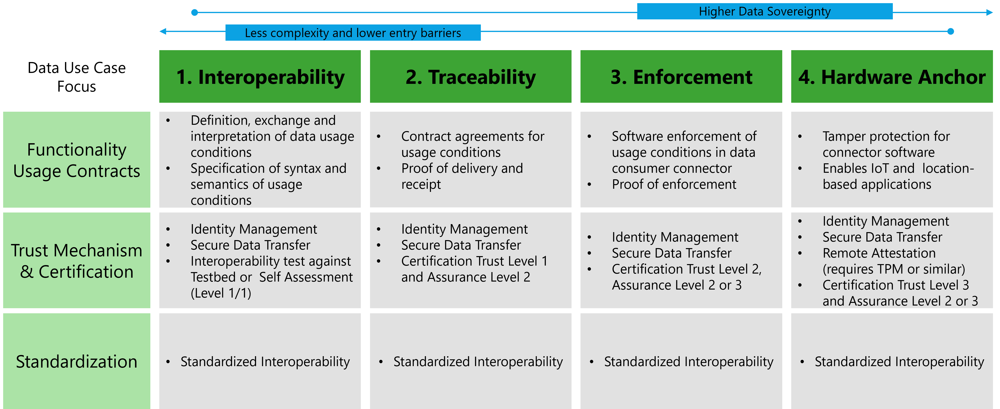
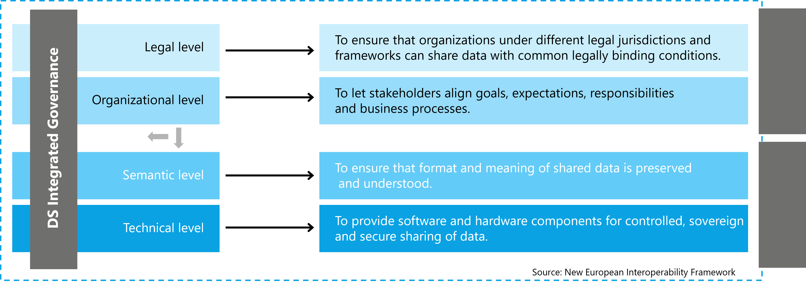

<!--
>
> This document is written in Markdown, to get started check the [basic Markdown Syntax](https://www.markdownguide.org/basic-syntax/).
>

> **Important Note**:
>
> Each file needs an introduction containing links to important resources to be considered to be
> known before reading. Think about which _section_ of the 
> [IDSA Rulebook](https://docs.internationaldataspaces.org/idsa-rulebook) need to be linked, which files in the RAM
> need to be linked.
-->

# Foundational aspects of a Data Space

This section covers the foundational aspects of Data Spaces. In the remainder of the document, a Reference Architecture is provided as a framework for building and maintaining Data Spaces focussing on five layers and three cross cutting perspectives.
Following the [glossary definition](https://dssc.eu/space/BVE/357073747/2+Core+Concepts) of the [Data Spaces Support Centre - DSSC](https://dssc.eu/) a Data Space is:

>A distributed system defined by a **governance framework** that enables secure and trustworthy data transactions between **participants** while supporting trust and **data sovereignty**.

Foundational for the understanding of the Data Space are the following concepts:

* The Core Role Model describes the mechanisms to participate in a Data Space, based on a given governance framework.
* Data Sovereignty as a goal to participate in Data Space and sharing data can be realized in various ways.
* Trust between the participants and in a Data Space as key goal of a referece Architecture.
* Interoperabiliy as a key enabler of Data Spaces and its different dimensions.
* Data Value Creation as an important goal of Data Space participants. This can be achieved beyond data marketplaces.

The following sections will provide an overview on those fundamental aspects. The details are covered in the remainder of the document. The [How to read this document]() provides guidance for readers.

## Core role model

It is the g
* Everthing is a participant
* Different roles exist DSGA, Partipant, Value Added services

## Data sovereignty

* Data Sovereignty is a continuum

## Trust in Data Spaces

* why is trust required
* what are the key characteristics of trust here

## Interoperability as key enabler for Data Spaces

* Interoperability is key
* Reference to EIF Layers
* Reference Semantic Interoperability Paper

## Data Value Creation

* How does the IDS RAM relate to Data Value creation, does it cover the blueprint for building a data marketplace and will it propose a business model? Brief sketch.

> Note: add a new perspective for Data Value Creation to the RAM (4.4) and try to fill it with content. Could be in the end an appendix.

> **Important Note**:
>
> Please provide links to files in the RAM, which are a good point to continue from here.
>
-->
