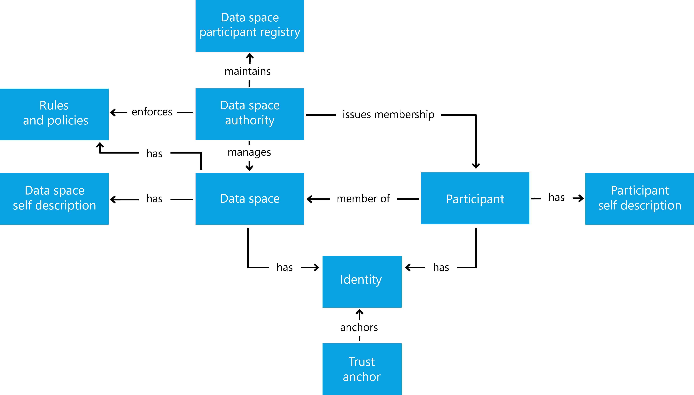

# Foundational aspects of a Data Space

## General considerations

Data Spaces combine various aspects to enable the sharing of data among organizations of different kinds. In general, data sharing requires not only a technical framework but also an organizational and legal framework to enable the collaboration of organizations. Therefore, Data Spaces are understood as a governance framework and supporting services to build trustworthiness and enable the sharing of data through an agreed set of policies, semantic models, protocols, and processes.

The principle of trusted data sharing is crucial for participants in Data Spaces. Participants of Data Spaces demand that their rights are protected and the data is handled as expected and defined in policies on multiple levels. This can be achieved in Data Spaces by the combination of commonly defined governance frameworks, protocols, and transparency measures. Furthermore, the ability to enforce data usage policies and the management of access rights is a measure to build trust in Data Spaces. This trustworthy environment facilitates data sharing and subsequently new business opportunities and innovation.

The IDS-Reference Architecture describes the technical concepts and mechanisms based on the structural definitions of the IDSA Rulebook. This foundational section provides an introduction to the core concepts of Data Spaces and the interaction mechanisms.

## Participation in Data Spaces

Participation in a Data Space is bound to the rules defined in the overarching governance framework, as described in the IDSA Rulebook. While the Data Space Governance Scheme describes the common goals of the participants, each participant will also pursue their individual goals. In a technical sense, this can be separated into:

* consuming data from other Data Space Participants
* providing data for other Data Space Participants
* both, providing and consuming data for and from other Data Space Participants.

Typically with the goal to generate any kind of value out of the data.
To do so, participants of a Data Space require interoperable solutions, and measures for trustworthiness to ensure their autonomy and agency while sharing and consuming data. The required solutions for the management of the participants of a Data Space, its governance scheme, and the participant's tools to provide claims and share data may vary depending on individual requirements.

The following diagram provides an overview of the Data Space concepts based on the IDSA Rulebook

## Data sharing contracts and its relation to Data sovereignty

While interoperability is a key requirement to enable participation in a Data Space, a participant can express the conditions for the usage of Data in data-sharing contracts that contain data usage policies.
Those policies express the rights and obligations associated with data.
The desired degree of organizational autonomy and agency depends on various aspects and requirements, e.g. the inherent value of the data or its relevance for both, the data provider and data consumer. While those requirements are expressed in the usage policies of the data sharing contract between Data Space Participants, the participants have to provide claims, which satisfy the policies. This policy/claims reconciliation is an important aspect of providing trust in a Data Space. The provisioning of policy enforcement techniques may be a requirement of a data usage policy.

A framework to determine the required degree of autonomy and agency of a participant is provided in ISO/IEC TS 10866 – Cloud Computing – Framework for Organizational Autonomy and Digital Sovereignty.

## Trust in Data Spaces

Trust in Data Space is based on two key aspects:

* Multi-level policies expressing rights and obligations: Policies can be defined on various levels. The sharing of data can be subject to regulations, the Data Space Governance Framework provides the fundamental rules for collaboration in a data space, and participants maintain individual agreements for data sharing. As described in the IDSA Rulebook, policies can be subject to access to data and to the usage of data.
* Claims as attributes of an entity. They can express various aspects, such as identity, statement of quality, conformity to standards, legal status, and location. Those express trustworthiness and enable trust between the data space participants.

> Note: Identities of organizations and services are an important claim when organizations interact, like in Data Spaces, but are not sufficient to enable trust between participants.

The [Trust Perspective](../../4_perspectives/4_1_trust/trust.perspective.md) elaborates in more detail on Trust in Data Spaces.

## Interoperability as a key enabler for Data Spaces

Data Sharing between organizations in a trusted way is a key motivation for Data Spaces. This requires Interoperability on various levels, e.g. Interoperability between organizations allows to “exchange information and to mutually use the information that has been exchanged” (See ISO/IEC 22123-1).

The interoperability facet model as defined in ISO/IEC 19941 breaks interoperability into five facets, which apply to Data Spaces and are the foundation for trusted data sharing between organizations.
The European Interoperability Framework describes a similar mechanism, but utilizing four layers. A detailed comparison is part of the [IDSA Rulebook section on Interoperability]().

The IDS-RAM information layer provides an overview of aspects of semantic interoperability. The systems layer describes in more detail the technical interoperability aspects and the process layer describes in more detail the behavioral aspects.

To do: see also semantic paper

## Data Value Creation

Data Value Creation can be achieved with various means. It is not limited to data marketplaces, but can also include increased transparency in supply chains, digital twins, and beyond. Such aspects depend on industry, domain, use cases, and business models. The value creation is therefore not subject to the IDS RAM. Further reading on Business Models for and in Data Spaces can be found in the [IDSA document on Data Space Business Models]().

## Summary

Data Spaces based on governance frameworks and supporting services to build trustworthiness and enable the sharing of data through an agreed set of policies, semantic models, protocols, and processes. Their key concepts are:

* Controlling the access and usage of data
* Establishing trust between participants during the data-sharing process and beyond
* Discoverability of data
* Negotiable data-sharing contracts
* Orchestration and management of the data-sharing process
* Adjustable Transparency and observability
* Interoperability

to achieve the autonomy and agency of the Data Space participants.

## References

* Learn more about business models in the business model paper
* Learn more about interoperability facets in [IS 19941]
* Learn more about interoperability in Data Spaces in the Dataspace Protocol
* Learn more about dataspaces in [20151]
