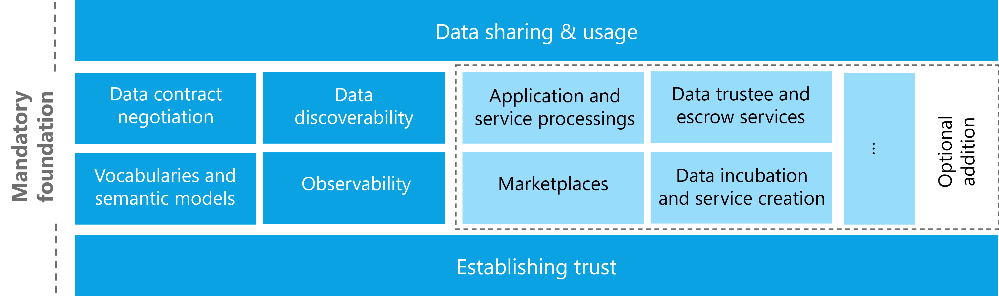

>
> This document is written in Mardown, to get started check the [basic Markdown Syntax](https://www.markdownguide.org/basic-syntax/).
>

> **Important Note**:
>
> Each file needs an introduction containing links to important resources to be considered to be
> known before reading. Think about which _section_ of the 
> [IDSA Rulebook](https://docs.internationaldataspaces.org/idsa-rulebook) need to be linked, which files in the RAM 
> need to be linked.

# Functional

Functional blocks are separated into mandatory and optional blocks

## Mandatory

* [Establishing Trust](./establishing.trust.md)
* [Data Discoverability](./data.discoverability.md)
* [Data Contract Negotiation](./data.contract.negotiation.md)
* [Vocabularies and semantics](./vocabularies.and.semantics.md)
* [Observability](./observability.md)
* [Data sharing](./data.sharing.md)

## Optional

* [Value added services](./value.added.services.md)

> **Important Note**:
>
> Please provide links to files in the RAM, which are a good point to continue from here.
>