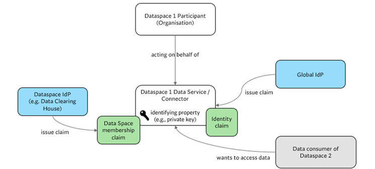
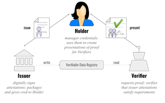

# Trust perspective

>
> This document is written in Markdown, to get started check the [basic Markdown Syntax](https://www.markdownguide.org/basic-syntax/).
>

> **Important Note**:
>
> Each file needs an introduction containing links to important resources to be considered to be
> known before reading. Think about which _section_ of the
> [IDSA Rulebook](https://docs.internationaldataspaces.org/idsa-rulebook) need to be linked, which files in the RAM
> need to be linked.

As Trust is a key aspect of Data Spaces, the Trust Perspective needs to describe clearly how existing mechanisms can be utilized to serve the needs of Data Spaces. This includes security measures for providing secure platforms and secure communications but also utilizing Usage Control mechanisms and their relation to privacy-enhancing and privacy-preserving technologies (PET, PPT).

## Objectives

No hanging paragraphs

### Definition of Actors

The IDS Reference Architecture Model describes the interaction between participants in a trusted context, i.e. a Data Space. The Trust Perspective of the IDS RAM shall provide insights into how Trust is established between the participants. As Trust is a decision of a participant to trust another participant in each context, the IDS-RAM can only describe mechanisms that can make a participant trustworthy, i.e. which claims can be provided. This is the foundation for the decision of a participant to trust another participant.

In general, three different actors can be distinguished in when discussing trust relationships in Data Spaces:

- Organizations
- Individuals
- Services, i.e. Data Space Connectors

The three of them have a clear relationship with each other. Individuals and Services act on behalf of an organization. In the context of the IDS-RAM organizations and Services are relevant for the Trust perspective. The trustworthiness of individuals and their relationship to the IDS-RAM are not in scope of the IDS-RAM. The interaction of individuals within a given system is sufficiently described in other standards. 

Both, Connectors and organizations need to provide attribute-based claims describing their trustworthiness in a given context. Such claims can represent their identity or other relevant claims. Those claims need to be interoperable to enable the interaction between participants and require a trust framework that describes processes and rules making claims comprehensible, i.e. making them verifiable. This is based on the so-called Triangle of Trust.

A participant in a Data Space, the verifier, needs to decide whether another participant in the Data Space, the holder, can be trusted in each context or not. To enable this decision the Holder may present several claims to the verifier. Those claims are issued by the Issuer of the claim, who followed the defined processes and rules to issue a claim to the holder. A verifier can request the issuer to validate a claim. The Triangle of Trust can be realized based on Verifiable Credentials and their presentation.

The holder of a verifiable credential operates in a triangle of trust, mediating between issuer and verifier.

- The issuer trusts the holder
- The holder trusts the verifier
- *The verifier trusts the issuer

Any role in the triangle of trust can be realized by an individual, an organization, or a service. As verifiable credentials can be created by anyone, the verifier decides if they trust the issuer, based on a given trust framework.

## Trust Frameworks

The IDS Reference Architecture model is agnostic of a given trust framework.  The processes and rules to establish Trust in a Data Space are subject to the Data Space Governance Framework. It supports the participants autonomy and agency and enables them to make an educated decision to trust another participant in a given context and subsequently to act accordingly.

A trust framework in the context of data spaces is a structured set of policies, standards, and agreements that establish the rules and requirements for ensuring secure, reliable, and ethical data exchange. It defines how organizations should manage, protect, and share data while maintaining mutual trust with the following key elements:

- Identity and Authentication: Establishes how parties in the data-sharing ecosystem verify each other's identity and credentials to ensure they are authorized to access and share data.
- Data Privacy and Security: Sets standards for protecting sensitive information, ensuring that all parties handle data in compliance with privacy laws (e.g., GDPR) and follow robust security protocols.
- Governance and Accountability: Outlines the roles, responsibilities, and accountability of each participating organization, ensuring transparency and legal compliance in data handling.
- Interoperability Standards: Defines the technical protocols and data formats for ensuring systems from different organizations can communicate and share data seamlessly.
- Trust Mechanisms: Includes mechanisms like digital signatures, encryption, and certificates to ensure data integrity and prevent unauthorized access during sharing.

## Interoperability concerns

Interoperability in the Triangle of Trust is crucial because it ensures that systems, applications, and services from different sources can work together seamlessly while maintaining security, trust, and data integrity. The Triangle of Trust refers to a security model that emphasizes the relationship between three key elements: trust, security, and interoperability. When systems are interoperable, it means they can exchange and use information in a reliable and secure manner, which is vital in Data Spaces that require collaboration across platforms or between organizations.

1. Seamless Integration Across Platforms: As a participant relies on multiple participants need to work together without compromising on security or efficiency. Interoperability allows them to exchange information and perform functions smoothly across various technologies.
2. Maintaining Security and Trust: When systems are interoperable, it ensures that the trust relationships between them are preserved. It prevents vulnerabilities and reduces the risk of data breaches or other security incidents.
3. Data Integrity and Consistency: Interoperability ensures that data is consistently and accurately transferred between systems, avoiding conflicts and maintaining its integrity.
4. Cost Efficiency and Scalability: Interoperable systems reduce the need for costly integration or customization efforts and allow for the easy addition of new services or systems, which is essential for long-term scalability.

ISO/IEC 19941 is a standard titled "Information technology — Cloud computing — Interoperability and portability", which outlines the requirements and guidance for ensuring that cloud services can interoperate with other systems and that data and applications can be ported between different cloud providers or systems with minimal disruption. This is directly relevant to the Triangle of Trust model because it addresses two key aspects:

1. Interoperability: The standard sets guidelines on how cloud services should communicate with each other and with external systems in a standardized and reliable way. This ties into the interoperability aspect of the Triangle of Trust, ensuring that trusted cloud services can share and manage data without compromising security.
2. Portability and Trust: It ensures that when data or applications are moved from one cloud provider to another, the trust and security model remains intact. This is critical for maintaining security and trust when using multiple cloud vendors, ensuring that the Triangle of Trust is preserved during data transfers.

Key Points of ISO/IEC 19941 and Interoperability in the Triangle of Trust:

- Common Interfaces: ISO/IEC 19941 defines how different cloud services should expose common interfaces to enable seamless communication and data exchange, which ensures interoperability.
- Portability of Data: The ability to share data between Data Space participants ensures that security and trust are maintained, preserving the integrity of the Triangle of Trust.
- Security Considerations: ISO/IEC 19941 emphasizes that interoperability and portability should not come at the cost of security, aligning with the need for trusted and secure communication within the Triangle of Trust.
In summary, interoperability in the Triangle of Trust is vital because it ensures systems can securely work together, sharing data and services while maintaining trust. ISO/IEC 19941 directly supports this by providing guidelines for interoperability and portability in cloud environments, ensuring that the trust and security pillars of the Triangle of Trust remain intact when systems communicate or migrate across different platforms.
The IDS RAM needs to cover the interfaces and security considerations, but also need to cover the data portability when it comes to claims, i.e. semantic and syntactic interoperability.

## Security considerations

Provide an overview of security considerations. Describe aspects to be considered, not recommendations.
<https://link.springer.com/chapter/10.1007/978-3-031-16088-2_10>

## Access and Usage Policies

Relationship between the different types of Policies (see Rulebook) and runtime aspects of policy enforcement.
Usage Control

- Describe the mechanisms of usage control
- Policy classes
- Relationship to implementations
- Take a look at <https://authzen-interop.net/docs/category/results> <https://openid.net/wg/authzen/>
- <https://www.researchgate.net/publication/342252961_Evaluation_Methodology_for_Distributed_Data_Usage_Control_Solutions>
