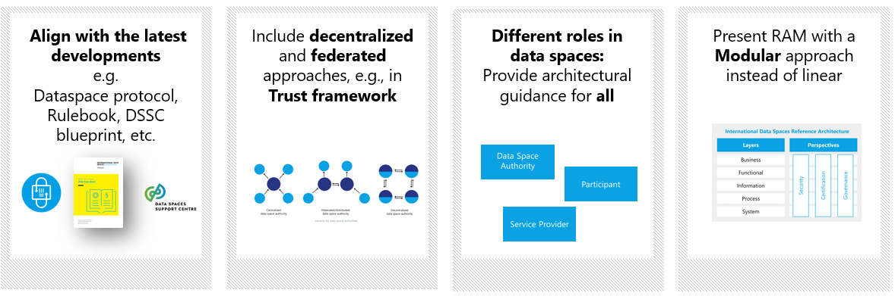
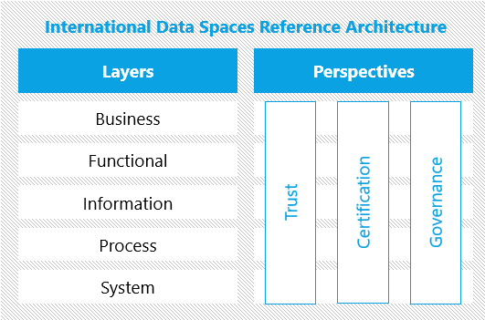

# IDS Reference Architecture Model Version 5 - Preliminary Draft
<!-- Note: This README will serve as the coverpage in the GitBook rendering of the IDS-RAM 5 content. So please keep only external info and links in this page -->

<!--
>
> This document is written in Mardown, to get started check the [basic Markdown Syntax](https://www.markdownguide.org/basic-syntax/).
>

> **Important Note**:
>
> Each file needs an introduction containing links to important resources to be considered to be
> known before reading. Think about which _section_ of the 
> [IDSA Rulebook](https://docs.internationaldataspaces.org/idsa-rulebook) need to be linked, which files in the RAM 
> need to be linked.
-->

## Table of Contents
* [Front Matter](./FrontMatter.md)
* [Introduction](./README.md)
* [Foundational Aspects](./3_layers/3_1_foundation/foundation.md)

## Introduction

The IDS-RAM (International Data Spaces Reference Architecture Model) provides a conceptual framework for designing and implementing IDS-compliant data spaces, following the [IDSA Rulebook](https://docs.internationaldataspaces.org/idsa-rulebook). It defines the key roles, their interactions, the components, and the principles that govern the architecture of an IDS data space. 

This first edition of IDS RAM-5 is not a complete version, but rather a preliminary draft to provide a glimpse of the updates coming up in the full version.

## Vision for IDS-RAM 5 ##

 

#### _Figure 1.1: Improvements envisioned for IDS RAM 5 at a high-level_####

RAM 5 will be aligned with the latest developments in IDSA and Data Spaces. It will provide an overview for technical readers on how to create an architecture for a data space, to participate in a data space, and to provide value added services for data spaces. To do so, RAM5 will sketch architectural decision areas for different roles in data spaces. 

The RAM 5 document will not be a linear document like RAM 4.0 but will contain links between parts of the layers and perspectives. Other improvements in RAM 5 will include description of decentralized approaches and updates to the information model, among other things.

## Timeline ##

The expected timeline is to provide a first draft of RAM 5 until the end of Quarter 2 2024 and a final document until the end of Quarter 2 2025.

## Structure ##

RAM 5 will follow the same five-layer structure used by RAM 4.0 to express various stakeholders’ concerns and viewpoints at different levels of granularity: business, functional, process, information, and system.

This will be complemented with three perspectives that need to be implemented across all these layers: Trust (previously named Security in RAM 4.0), Certification and Governance.

 

#### _Figure 1.2: Layers and Perspectives of IDS RAM_####

Each of these layers and perspectives will be described in a different section of this document. 

Two additional sections will be added to provide additional context for the readers:

- Foundation section, which will present all the concepts that one should be familiar with before delving into the details of the RAM layers and perspectives.
- Context of IDS section, to provide overall info on IDS, and how it relates to other initiatives and concepts.

## How to contribute ##
IDS-RAM is co-created by the members of the [International Data Spaces Association](https://internationaldataspaces.org/) as part of the activities in the IDSA [Working Group Architecture](https://internationaldataspaces.org/we/working-groups/).
To become a contributor, please consider joining [IDSA](https://internationaldataspaces.org/we/become-a-member/) and register using the [interest form](https://forms.office.com/e/sP4PztkiCE) for RAM 5. 

All other feedback are welcome as well! Please contact the [IDSA Head Office](https://internationaldataspaces.org/offers/reference-architecture/) for any comments on IDS-RAM 5.

## Further resources ##

To have more context, please consider taking a look at the following resources:

The previous release version of IDS-RAM:
- IDS-RAM 4.0 in [Docs](https://docs.internationaldataspaces.org/ids-knowledgebase/v/ids-ram-4) and on [Github](https://github.com/International-Data-Spaces-Association/IDS-RAM_4_0/)
- A webinar which provides a high-level overview of IDS-RAM 4.0: [IDSA TechTalk Recording](https://youtu.be/vyhGrT2pEOg) & [Slides](https://internationaldataspaces.org/wp-content/uploads/dlm_uploads/IDSA-Tech-Talk-IDS-RAM.pdf)

The following documents that complement the RAM:
- [IDSA Rulebook](https://docs.internationaldataspaces.org/idsa-rulebook-v2/) describes how to operate a dataspace based on the BLOFT (Business, Legal, Operational, Functional, Technical) aspects.
- [Dataspace Protocol](https://docs.internationaldataspaces.org/dataspace-protocol/overview/readme) is a set of specifications designed to facilitate interoperable data sharing between entities governed by usage control and based on Web technologies. 
- [DSSC Blueprint](https://dssc.eu/space/bv15e/766061351/Introduction+-+Key+Concepts+of+Data+Spaces) is a set of guidelines by the [Dataspaces support Centre](https://dssc.eu/) to support the development cycle of data spaces. It includes the conceptual model of a data space, data space building blocks, and recommended standards and specifications.

<!--## Foundational aspects

[Foundational Aspects](./foundation/foundation.md) for the understanding of Data Spaces. 

## Layers of the Reference Architecture Model

* [Business](./business/business.md)
* [Functional](./functional/functional.md)
* [Information](./information/information.md)
* [Processes](./processes/processes.md)
* [Systems](./systems/systems.md)

## How to read the Reference Architecture Model

> **Important Note**:
>
> Please provide links to files in the RAM, which are a good point to continue from here.
> -->
